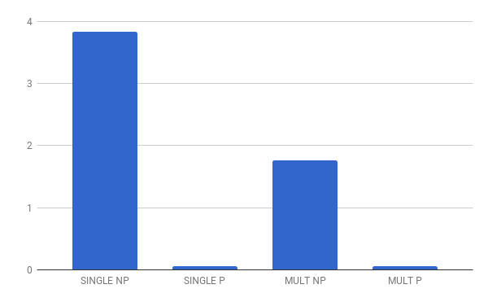

MC723A - IC - UNICAMP, *29/06/2017*

# Projeto 3 - Multicore e Aceleração em Hardware

**Grupo**
* Allana Idalgo **145166**
* Lucas Calzolari **146987**
* Ricardo Zaideman **151238**
* Vítor Eichemberger **149053**

## Software

Vamos implementar uma versão do algoritmo de Monte Carlo tree search para jogar "jogo da velha" NxN, onde o jogador que preeencher 3 casas adjacentes perde.

## Periférico

O periférico será uma GPU capaz de simular múltiplos jogos simultaneamente. Para uma dada precisão a GPU acelerará a função de decisão sobre a melhor jogada a partir de um estado do jogo.

## Estratégia

A estratégia será realizar jogos entre duas AIs com determinadas precisões em 4 arquiteturas diferentes.  

* Singlecore sem periférico
* Multicore sem periférico
* Singlecore com periférico
* Multicore com periférico  

Analizando como cada uma destas se comportam com relação ao tempo de execução ou precisão do algoritmo.

## Ferramentas
* ArchC
* MIPS TLM - Simulador de MIPS (em ArchC)

## Testes

Após o desenvolvimento do projeto, primeiramente em termos de código, partimos para a criação e execução dos testes.

Para as medições usamos número de instruções executadas pelo simulador

As configurações usadas foram:

| Configuração | Número de Cores (CPU) | Uso do Periférico |
|--------------|-----------------------|-------------------|
| **Single NP**| 1 (Singlecore)        | Não               |
| **Multi NP** |   (Multicore)         | Não               |
| **Single P** | 1 (Singlecore)        | Sim               |
| **Multi P**  |   (Multicore)         | Sim               |

## Resultados

Com a execução dos casos teste acima, tivemos os segintes resultados:

|    TESTES    | **Single NP** | **Single P** | **Multi NP** | **Multi P** |
|--------------|---------------|--------------|--------------|-------------|
| 1            | 3771217529    | 55923603     | 1831222818   | 55923603    |
| 2            | 3719378742    | 55923603     | 1832486370   | 55923603    |
| 3            | 3985074556    | 55923717     | 1624347609   | 55923717    |
| **Média**    | 3825223609    | 55923641     | 1762685599   | 55923641    |

## Análise e Conclusão

Por fim, concluímos que o algorítmo escolhido é em quase sua totalidade trivialmente
paralelizável, o que permite que a carga de trabalho e seu tempo de execução seja dividido
pelo número de processadores.
Na adição de uma GPU a capacidade desta de executar cálculos simultâneos torna desprezível
a capacidade do processador, tornando o tempo quase constante
